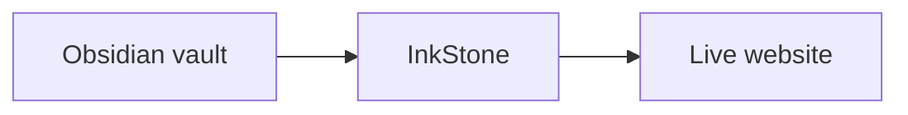
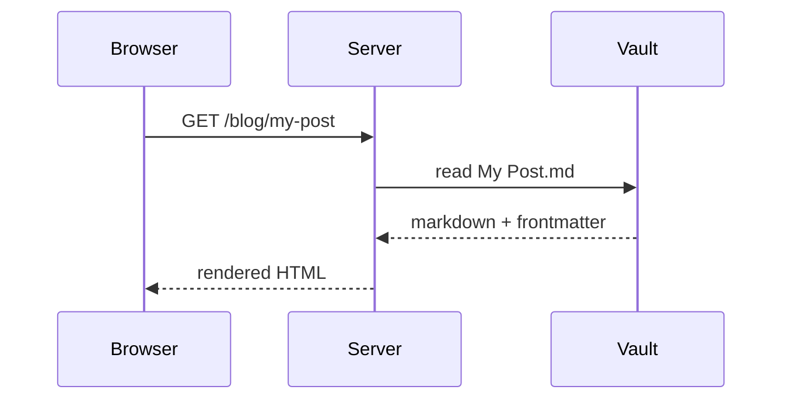

## Callouts

Callouts are blockquotes with a type identifier. InkStone renders them as styled boxes.

```markdown
> [!note]
> A neutral informational note.
```

> [!note]
> A neutral informational note.

```markdown
> [!tip] Pro tip
> A helpful suggestion with a custom title.
```

> [!tip] Pro tip
> A helpful suggestion with a custom title.

```
> [!warning] Watch out
> Something that could go wrong.
```

> [!warning] Watch out
> Something that could go wrong.

```markdown
> [!info] Did you know
> A fact or context.
```

> [!info] Did you know
> A fact or context.


```markdown
> [!danger] Danger
> A critical warning.
```

> [!danger] Danger
> A critical warning.


```markdown
> [!success] Done
> Confirmation of completion.
```

> [!success] Done
> Confirmation of completion.


```markdown
> [!question] FAQ
> A question and its answer.
```

> [!question] FAQ
> A question and its answer.


```markdown
> [!abstract] Summary
> A condensed overview.
```

> [!abstract] Summary
> A condensed overview.


```markdown
> [!bug] Known issue
> A documented bug or limitation.
```

> [!bug] Known issue
> A documented bug or limitation.


```markdown
> [!example] Example
> A worked example.
```

> [!example] Example
> A worked example.


```markdown
> [!quote] Quote
> A blockquote with attribution style.
```

> [!quote] Quote
> A blockquote with attribution style.

---

### Collapsible callouts

Add `-` after the type to make the callout collapsed by default, `+` to pin it open:

```markdown
> [!tip]- Click to expand
> This content is hidden until the user clicks.

> [!info]+ Always open
> This callout starts expanded and stays that way.
```

> [!tip]- Click to expand
> This content is hidden until the user clicks.

> [!info]+ Starts open
> This callout starts expanded and stays that way.

---

### Multi-paragraph callouts

Indent continuation lines with `>` to include multiple paragraphs:

```markdown
> [!note] Multi-paragraph
> First paragraph.
>
> Second paragraph — still inside the callout.
```

> [!note] Multi-paragraph 
> First paragraph. 
> 
> Second paragraph — still inside the callout.

---

## Checkboxes

```markdown
- [ ] Unchecked task
- [x] Completed task
  - [ ] Nested unchecked
  - [x] Nested completed
```
- [ ] Unchecked task
- [x] Completed task
  - [ ] Nested unchecked
  - [x] Nested completed

> Rendered as interactive-looking (but static) checkbox lists with indentation.

---

## Highlights

```markdown
This is ==highlighted text== inline.
```

This is ==highlighted text== inline.

> Renders with a yellow background highlight, identical to Obsidian's highlight marker.

---

## Footnotes

```markdown
This sentence has a footnote.[^1]

[^1]: This is the footnote definition, rendered at the bottom of the page.
```
This sentence has a footnote.[^1]

[^1]: This is the footnote definition, rendered at the bottom of the page.


> Footnote references are clickable; clicking the number in the footer returns to the inline marker.

---

## Syntax highlighting

Fenced code blocks with a language tag get syntax highlighting, a copy button, and a language label:

````markdown
```python
def hello(name: str) -> str:
    return f"Hello, {name}!"
```
````

````markdown
```bash
git clone https://github.com/airenare/inkstone.git
cd inkstone && pip install -r requirements.txt
```
````

````markdown
```yaml
---
website: true
title: My Post
---
```
````

Supported languages include `python`, `bash`, `yaml`, `json`, `javascript`, `typescript`, `html`, `css`, `sql`, `markdown`, and many more (via Pygments).

---

## Math / LaTeX

Inline math uses single `$` delimiters; block math uses `$$`. Both are rendered via KaTeX.

```markdown
The formula is $E = mc^2$.

$$
\int_0^\infty e^{-x^2} dx = \frac{\sqrt{\pi}}{2}
$$
```
The formula is $E = mc^2$.

$$
\int_0^\infty e^{-x^2} dx = \frac{\sqrt{\pi}}{2}
$$

> [!note] Safe from markdown mangling
> InkStone pre-processes math blocks before the markdown parser runs, preventing `_` and `*` characters inside formulas from being interpreted as emphasis.

---

## Mermaid Diagrams

Fenced ` ```mermaid ``` ` blocks render as interactive diagrams client-side. Diagrams adapt automatically to the current dark/light theme.

````markdown

````


````markdown

````


All standard Mermaid diagram types are supported: `graph`, `sequenceDiagram`, `flowchart`, `classDiagram`, `gantt`, `pie`, `erDiagram`, and more.
